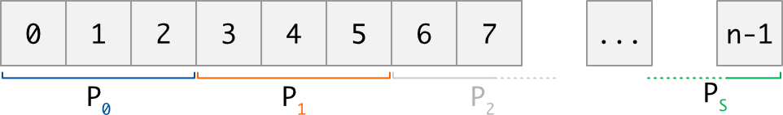
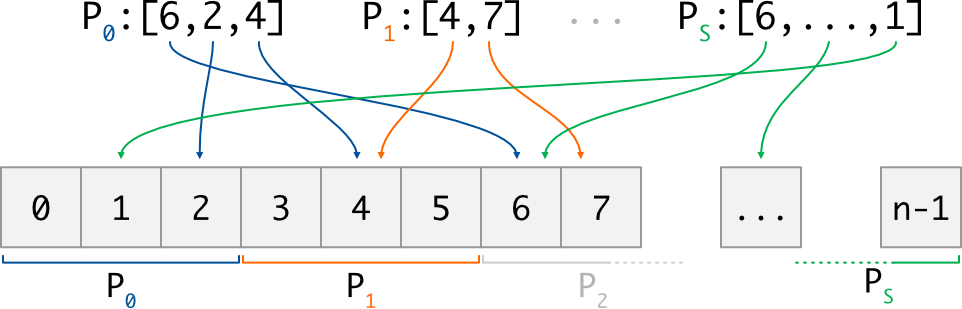
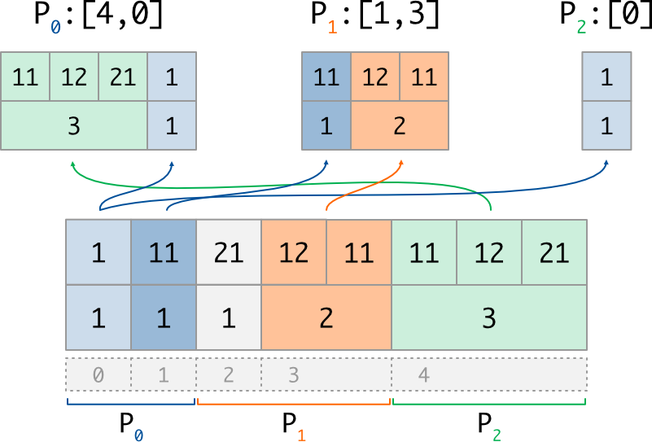
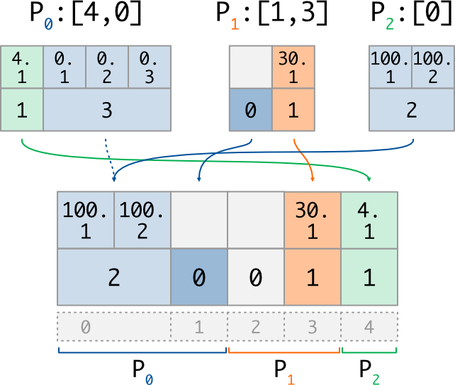

Global Indexer
==============

The global indexer is a *protocol object* allowing to access distributed data in read or
write mode.

It has been inspired by the ``BlockToPart`` and ``PartToBlock`` protocols implemented in
`ParaDiGM <https://github.com/onera/paradigm>`_
library, and influenced by some conventions used in
`numpy <https://numpy.org/doc/stable/user/basics.indexing.html#>`_ and
`mpi4py <https://mpi4py.readthedocs.io/en/stable/tutorial.html>`_ packages.

Purpose
-------

Since the global indexer can be seen as an extension of numpy ``take`` and ``put``
functions, let's start by recalling what these functions do.

Considering  a one-dimensional data array ``arr`` of size :math:`n`,
a list of indices ``ind`` of size :math:`p` (where each index ``i`` satisfies :math:`0 \le i \lt n`),
and a list of values ``val`` of size :math:`p` :

- ``numpy.take(arr, ind)`` loops over each index ``i`` of ``ind``, extract the value ``arr[i]`` and returns a new array of size :math:`p`.
  Note that this is also the operation performed by ``out = arr[ind]``;
- ``numpy.put(arr, ind, val)`` loops over each index/value pair ``i,v``, and write the value ``v`` at the position ``i`` in ``arr``.
  Note that this is also the operation performed by ``arr[ind] = val``.

The aim of the global indexer is to offer similar functionnalities on **distributed data**, in a parallel context. 

Distributed data is the term used in maia to describe a *collection* (in general a data array)
that is dispatched across several MPI processes. The way the global data is dispatched must fulfill
some rules described in the :ref:`introduction <intro>`, but the main idea is just that each MPI process gets a section
of the collection, function of its rank in the MPI communicator:

To access data, each MPI process comes with a sequence of indices. Each index ``i`` is provided using
*global indexing*, ie. the (virtual) numerotation of the global collection. In other words, as in
the numpy analogy, each index ``i`` must satisfy the relation :math:`0 \le i \lt n` where :math:`n` is the
global size of the distributed collection; it is the role of the global indexer to access data physically hold
by other processes.
Note also that the number of indices may be different on each process:

Now, let give a glance on what the global collection can actually represent; different kind of data
are supported, and we provide a different put/take implementation for each of them. Here
following mpi4py conventions, the supported data kind are:

- **Generic Python objects**: the global collection is a list of size :math:`n`, and each of its items
  is an ordinary Python object::

    #    0     1     2        3                      4   # Global Index
    d = [3.14, None, 'chars', ['even', 'a', 'list'], 42] # Sequence

  Methods to be used in this case start with a lowercase letter, such as
  :func:`~maia.transfer.protocols.GlobalIndexer.take` or :func:`~maia.transfer.protocols.GlobalIndexer.put`.
  Objects are serialized during exchanges, using the ``pickle`` module: this is all-purpose but slowest
  way.

- **Buffer-like objects**: the global collection is a buffer, *ie.* a flat and homogeneous array
  (typically, a numpy array) of size :math:`c*n` with :math:`c \in N^\star` : each item 
  of it is a group of :math:`c` values. Of course, it is common
  to have :math:`c=1`, meaning that each item of the collection is a single value::

    #          0     1      2     3     4                   # Global Index
    d = array([True, False, True, True, False], dtype=bool) # Buffer (c=1)

    #          0    1    2      3      4                    # Global Index
    d = array([3,5, 5,7, 11,13, 17,19, 29,31], dtype=int)   # Buffer (c=2)

  Methods to be used in this case start with an uppercase letter, such as
  :func:`~maia.transfer.protocols.GlobalIndexer.Take` or :func:`~maia.transfer.protocols.GlobalIndexer.Put`.

- **Variable buffer objects**: the global collection is still an homogeneous buffer, but
  the number of values may differ from each item; consequently, two arrays are needed:

    - a counting array of :math:`n` integers, storing the number of data :math:`c_i` for each item :math:`i` 
    - the buffer array of size :math:`\sum_i c_i`, storing the data values:

  ::

    #          0  1   2   3       4                       # Global Index
    c =       [1, 1,  1,  2,      3         ]             # Counts
    d = array([1, 11, 21, 12, 11, 11, 12, 21], dtype=int) # Buffer

  Methods to be used for such data start with an uppercase letter and finish with ``_v``, such as
  :func:`~maia.transfer.protocols.GlobalIndexer.Take_v` or :func:`~maia.transfer.protocols.GlobalIndexer.Put_v`.

Usage
-----

.. important:: The instanciation of the global indexer, as well as all the ``take`` and ``put`` 
  implementations, hide collective MPI communications. Deadlocks will occur
  if they are not called by all the processes of the provided communicator.

.. rubric:: Initialization

The first step is to initialize the :class:`~maia.transfer._protocols.g_indexer.GlobalIndexer`
object by providing, in addition to the MPI communicator, two informations:

- How the global collection is distributed: this is done through the ``distrib`` array,
  an integer array of size :math:`s+1` (:math:`s` beeing the number of processes)
  where ``distrib[j]`` and ``distrib[j+1]`` represents
  respectively the lower (included) and upper (excluded) bounds held by process :math:`j`.
  This data must be the same for all calling processes.

- The list of global indices to access: this is done through the ``idx`` array,
  an integer array of size :math:`p_j` where each index :math:`i` satisfies
  :math:`0 \le i \lt n`.
  This data can be (and most of time, is) different on each calling process.

::

    from mpi4py.MPI import COMM_WORLD as comm
    from numpy      import array, empty
    rank = comm.Get_rank()

    # This example has been written for 3 processes
    distri = array([0, 2, 4, 5])         # Global collection size is 5
    if rank == 0:  idx = array([4, 0])   # P0 will access indices 4 and 0
    if rank == 1:  idx = array([1, 3])   # P1 will access indices 3 and 1
    if rank == 2:  idx = array([0])      # P2 will access index 0

    GI = GlobalIndexer(distri, idx, comm)

The creation of the object will fail if any requested index outpasses the bounds of the
distribution. All other configurations are managed, including the following cases:

 - a process can request access to no indices, by providing an empty integer array;
 - two process can request access to the same index, and a given process can even
   request access to the same index more than once;
 - it is not mandatory to have all the indices of the collection to be accessed.

.. rubric:: Exchanges

.. note:: The global indexer is a *protocol object*: once initialized, it allows to access
  multiple global arrays in the same specific manner. One of the main reason to use a
  global indexer in the first place is that we can construct the protocol only once
  (which is costly), and then exchange data over multiple arrays by using it.
  

It is important to understand that thanks to the variable buffer mode, two distributed data
of different kind can share the same distribution and access indices: all
the below examples are illustrated for the same distribution and access indices.

**Generic Python objects**:
to read or write generic Python object, one just have to store them in lists::

  if rank == 0:  dist_data = [3.14, None]              #global indices 0..2
  if rank == 1:  dist_data = ['chars', ['a', 'list']]  #global indices 2..4
  if rank == 2:  dist_data = [42]                      #global indices 4..5

  extr = GI.take(dist_data)
  # P0 : extr = [42, 3.14]                          #requested indices [4,0]
  # P1 : extr = [None, ['a', 'list']]               #requested indices [1,3]
  # P2 : extr = [3.14]                              #requested indices [0]

  if rank == 0:  data = [42, 3.14]                  #write at indices [4,0]
  if rank == 1:  data = [None, ['A', 'LIST']]       #write at indices [1,3]
  if rank == 2:  data = [.314]                      #write at indices [0]

  dist_data = GI.put(data)
  # P0 : dist_data = [.314, None]                      #global indices 0..2
  # P1 : dist_data = [None, ['A', 'LIST']]             #global indices 2..4
  # P2 : dist_data = [42]                              #global indices 4..5

  
There is nothing surprising for the ``take`` case. For the ``put`` case, notice that:

- several processes provided data for global index 0 : the last one
  (with inscreasing ranks order) was kept;
- no process provided data for global index 2 : the value ``None`` has been used.

The first rule applies also to buffers implementations; for the second rule,
unreferenced indices will remain unitialized when using
:func:`~maia.transfer.protocols.GlobalIndexer.Put`, and will get a zero counts when using
:func:`~maia.transfer.protocols.GlobalIndexer.Put_v`.

**Buffer-like objects**:
for buffer object of constant size, we offer two alternatives: the
output buffer can either be provided to the function by the user, as in mpi4py,
or be allocated by the function as a numpy array if ``None`` value is used::

  # Buffer of ints, with 2 values per index (c=2)
  if rank == 0:  dist_data = array([3,5,5,7],     dtype=int)  #glob idx 0..2
  if rank == 1:  dist_data = array([11,13,17,19], dtype=int)  #glob idx 2..4
  if rank == 2:  dist_data = array([29,31],       dtype=int)  #glob idx 4..5

  extr = GI.Take(dist_data, None, count=2)
  # We extract 2 values per requested index
  # P0 : extr = array([29,31,3,5], dtype=int)   #requested indices [4,0]
  # P1 : extr = array([5,7,17,19], dtype=int)   #requested indices [1,3]
  # P2 : extr = array([3,5],       dtype=int)   #requested indices [0]

  dn = distri[rank+1] - distri[rank]
  dist_data_new = empty(2*dn, dtype=int)
  dist_data_new.fill(-1) # To track unitialized values

  GI.Put(extr, dist_data_new, count=2)
  # P0 : dist_data_new = array([3,5,5,7],     dtype=int)      #glob idx 0..2
  # P1 : dist_data_new = array([-1,-1,17,19], dtype=int)      #glob idx 2..4
  # P2 : dist_data_new = array([29,31],       dtype=int)      #glob idx 4..5

Note that as explained above, data at position 2 in ``dist_data_new`` kept
its original value, since no process provided data for this index.
Also note that when using the preallocated buffer mode, it is the user's responsibility to allocate
the output buffer to the correct size and datatype.

**Variable buffer objects**:
when it's come to variable buffer, an additional array of counts has to be used.
For now, this array has to be a numpy array of integers. The data buffer
can still be any object supporting the buffer protocol.
This is the most complex implementation, but it allows to work with sparse data
since a count of 0 is allowed for any global index.

Following what is done in the previous paragraph, the output variable buffer
is allocated by the function as a pair of numpy array if ``None`` argument is used,
or can be provided to the function by the user. In this case, the output array of counts
is supposed to be by known; only the output data buffer is filled.

Here is an exemple of the ``take`` implementation for a variable buffer::

  # Variable buffer of ints, with number of values described by counts array
  if rank == 0:
    counts    = array([1,1])                 #nb of values for glob idx 0..2
    dist_data = array([1,11],     dtype=int) #values (1, then 1)
  if rank == 1:
    counts    = array([1,2])                 #nb of values for glob idx 2..4
    dist_data = array([21,12,11], dtype=int) #values (1, then 2)
  if rank == 2:
    counts    = array([3])                   #nb of values for glob idx 4..5
    dist_data = array([11,12,21], dtype=int) #values (3)

  counts_o, extr = GI.Take_v((counts, dist_data))
  # P0 : counts_o = array([3,1])                   #nb of vals got for [4,0]
  #      extr     = array([11,12,21,1], dtype=int) #values (3, then 1)
  # P1 : counts_o = array([1,2])                   #nb of vals got for [1,3]
  #      extr     = array([11,12,11], dtype=int)   #values (1, then 2)
  # P2 : counts_o = array([1])                     #nb of vals got for [0]
  #      extr     = array([1], dtype=int)          #values (1)

which can be illustrated as follow:

And here is an exemple of the ``put`` implementation for a variable buffer::

  if rank == 0:
    counts = array([1,3])                      #nb of vals to write at [4,0]
    values = array([4.1,0.1,0.2,0.3],dtype='f')#values (1, then 3)
  if rank == 1:
    counts = array([0,1])                      #nb of vals to write at [1,3]
    values = array([30.1],           dtype='f')#values (0, then 1)
  if rank == 2:
    counts = array([2])                        #nb of vals to write at [0]
    values = array([100.1,100.2],    dtype='f')#values (2)

  counts_new, dist_data_new = GI.Put_v((counts, values))
  # P0 : counts_new    = array([2,0])                   #nb of vals for 0..2
  #      dist_data_new = array([100.1,100.2],dtype='f') #values (2, then 0)
  # P1 : counts_new    = array([0,1])                   #nb of vals for 2..4
  #      dist_data_new = array([30.1],       dtype='f') #values (0, then 1)
  # P2 : counts_new    = array([1])                     #nb of vals for 4..5
  #      dist_data_new = array([4.1],        dtype='f') #values (1)

with its corresponding illustration (note that 0-length data does not *really* exist in memory):

We can check that, in each case, the size of the counting array is equal to
the number of described data (ie the len of the distributed section, or
the len of the requested indices list), and that the size of the data buffer
is equal to the sum of the associated counting array.

Once again, one can observe the resolution of writting conflicts:
for global index 0, which is accessed twice, the written data
(and thus its counts value) come from the process having the highest rank (P2).
This is why we used a dashed arrow for P0 on the scheme: its value is not written
in the distributed array, because of priority order.
Note also than unaccessed indices (such as index 2) automatically get a 0 count after
the ``Put_v`` operation: on the other side, index 1 get a 0 count because it was
explicitly put by P1.

API reference
-------------

.. autoclass:: maia.transfer.protocols.GlobalIndexer
    :members:
    :member-order: bysource

.. autoclass:: maia.transfer.protocols.GlobalMultiIndexer
    :members:
    :member-order: bysource