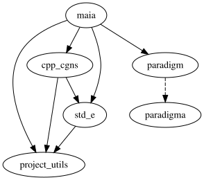

Development workflow
====================

Sub-modules
-----------

It is often practical to develop Maia with some of its dependencies, namely:

* :code:`project_utils`
* :code:`std_e`
* :code:`cpp_cgns`
* :code:`paradigm`
* :code:`pytest_parallel`

For that, we rely on Git submodules. Maia submodules are located at :code:`$MAIA_FOLDER/external`. If you have already successfully built Maia, the submodules have been populated (probably with :code:`git submodule update --init`).

If you need to modify one of the submodule library, e.g. :code:`std_e`, go to :code:`$MAIA_FOLDER/external/std_e` where you can use Git on a local repository of :code:`std_e`. For more details on how submodules work, we advise `this tutorial <https://delicious-insights.com/en/posts/mastering-git-submodules/>`_.

The graph dependency of Maia with respect to its submodules is the following:

In order for submodules to work as you would expect when developping within several dependencies at the same time, we advise you to source `this script <https://github.com/onera/project_utils/blob/master/git/submodule_utils.sh>`_, and then use:

.. code-block:: bash

  cd $MAIA_FOLDER
  git_config_submodules

It will ensure that commits in one submodule (e.g. :code:`std_e`) is acknowledged by all the depending sub-modules (e.g. :code:`cpp_cgns`), not only by Maia.

Launch tests
------------

Tests can be launched by calling CTest, but during the development, we often want to parameterize how to run tests (which ones, number of processes, verbosity level...).

There is a :code:`source.sh` generated in the :code:`build/` folder. It can be sourced in order to get the correct environment to launch the tests (notably, it updates :code:`LD_LIBRARY_PATH` and :code:`PYTHONPATH` to point to build artifacts).

Tests can be called with e.g.:

.. code:: bash

  cd $PROJECT_BUILD_DIR
  source source.sh
  mpirun -np 4 external/std_e/std_e_unit_tests
  ./external/cpp_cgns/cpp_cgns_unit_tests
  mpirun -np 4 test/maia_doctest_unit_tests
  mpirun -np 4 pytest $PROJECT_SRC_DIR/maia
