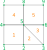

Variable stride arrays
======================

.. currentmodule:: maia.utils.ndarray.vstride

This page presents the concept of variable stride array objects
and an utility class to manipulate it.

Rationale
---------

A variable stride array (hereafter *VS array* ) is conceptually an array of :math:`N` arrays,
where each subarray have a different size but the same datatype. This differs from multidimensional arrays
(such as numpy `ndarray <https://numpy.org/doc/stable/reference/arrays.ndarray.html>`_)
which have a rectangular shape.

A typical usage of *VS array* is the representation of mesh connectivities,
since the number of neighbor is not the same for each entity of the mesh. For exemple,
if we want to exprime the vertex-to-cell connectivity of the following mesh,

we would have the single value 1 for the first vertex, then the pair of values (1,2) for the
second vertex, the pair of values (2,3) for the third vertex, etc. The vertex most connected
vertex is n°5 for which we would have the five values (1,2,3,4,5).

A *VS array* could be implemented as a list of arrays (here ``[[1], [1,2], [2,3], ..., [5]]``),
but for performance issues, it is often preferable to store the data in a single memory contiguous buffer.
We call it the ``values`` of the *VS array*.  Therefore, an additional information is needed
to know where starts and ends each subarray: we can use either 

- a ``counts`` array of size :math:`N`, where ``counts[i]`` store the lenght of the *ith* subarray,
- or a ``displs`` array of size :math:`N+1`, where ``displs[i]`` store the starting position of the *ith*
  subarray in the ``values`` array.

  ::

    #Index    0  1     2     3     4              5     6  7     8
    counts = [1, 2,    2,    2,    5,             2,    1, 2,    1]             
    displs = [0, 1,    3,    5     7,             12,   14,15,   17, 18]          
    values = [1, 1, 2, 2, 3, 1, 4, 1, 2, 3, 4, 5, 3, 5, 4, 4, 5, 5]

Note that ``counts`` and ``displs`` are redondant: in this data structure, it is not permitted
to use the ``displs`` array to jump over some parts of ``values`` or to change the order of elements.
Thus, the following properties holds:

- ``counts ≥ 0`` and ``counts.sum() == values.size``
- ``displs[i+1] = displs[i] + counts[i]``, with ``displs[0] = 0``. In particular, ``displs[N]==values.size``.

In the remaining of this page, we will use the term *strides* to designate
this virtual slicing of the *VS array*. The subarrays, who are thus sections of the
``values`` arrays, will be called *blocks*. We emphasize the fact that an *element*
of the *VS array* is a whole *block*.

.. note:: 
  - The CGNS standard uses the ``displs`` option to describe polyedric elements;
    this is the so called ``ElementStartOffset`` node.
  - In sparse linear algebra, the `CSR data structure <https://en.wikipedia.org/wiki/Sparse_matrix>`_
    is quite similar to a *VS array*,
    with the difference that CSR stores an additional array containing the column
    index its elements.

Python module
-------------

Maia provides the ``vstride`` module in order to operate on such data structure.
This module defines the :class:`VStrideArray` class as well as some functions
operating on *VS arrays*.

For now, the underlying fields of a *VS array* are represented by numpy arrays.
The ``values`` array is allowed to have any supported datatype, while the ``counts``
and ``displs`` arrays are requested to be integer arrays of same datatype
(either ``int32`` or ``int64``).

.. tip::
  In this documentation, the module namespace is denoted ``vs``, while ``np`` designate the
  ``numpy`` module::

    >>> import numpy as np
    >>> from maia.utils import vstride as vs

The VStrideArray object
^^^^^^^^^^^^^^^^^^^^^^^

.. autoclass:: VStrideArray
  :members:

Arrays routines
^^^^^^^^^^^^^^^

The ``vstride`` module provides the following routines in order to create or
manipulate :class:`VStrideArray` instances:

**Creation routines** : these routines offer shortcuts to create a new :class:`VStrideArray` from other input data

.. autosummary::
  :nosignatures:

  array
  from_counts
  from_displs

**Indexing routines** : describe here (TODO)

.. autosummary::
  :nosignatures:

  take
  insert
  delete

**Algorithms** : these routines apply an algorithm to :class:`VStrideArray` object.
All these functions take a parameter ``axis`` to indicate if the algorithm is applied:
  
-  independantly on each block of the array (using :data:`INNER_AXIS`)
-  globally over the elements of the array (using :data:`OUTER_AXIS`)

.. autosummary::
  :nosignatures:

  flip
  sort
  unique

--------------------------------------------------------

.. automodule:: maia.utils.ndarray.vstride
  :members: array, from_counts, from_displs, take, delete, insert, flip, sort, unique
  :member-order: bysource

.. autodata:: Axis
  :annotation: : Enum class

.. autodata:: ReduceOp
  :annotation: : Enum class

.. autodata:: INNER_AXIS
  :no-value:
.. autodata:: OUTER_AXIS
  :no-value:
