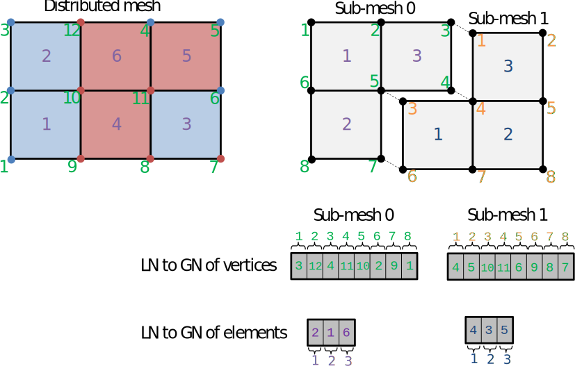
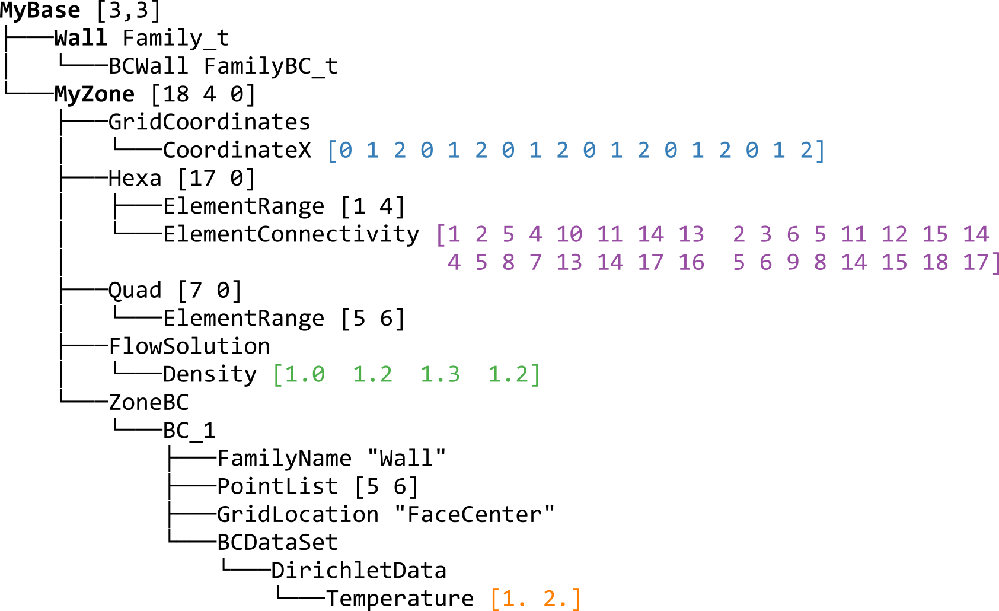
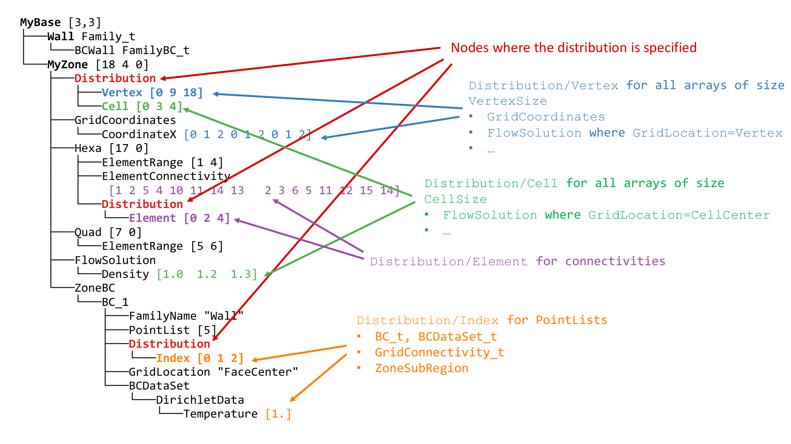
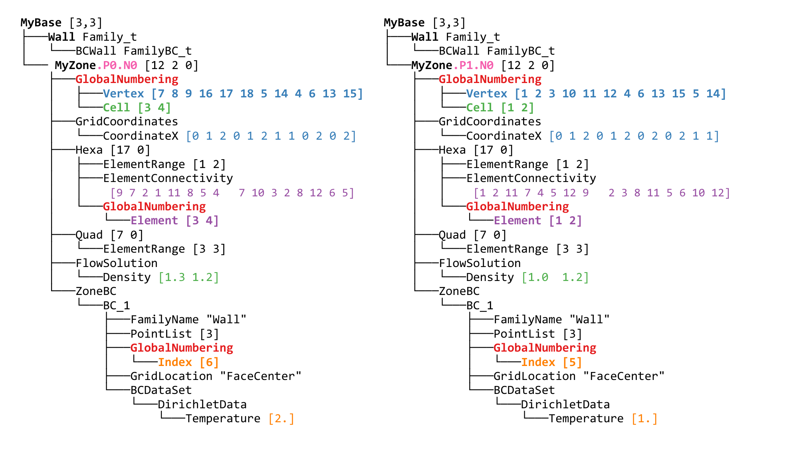
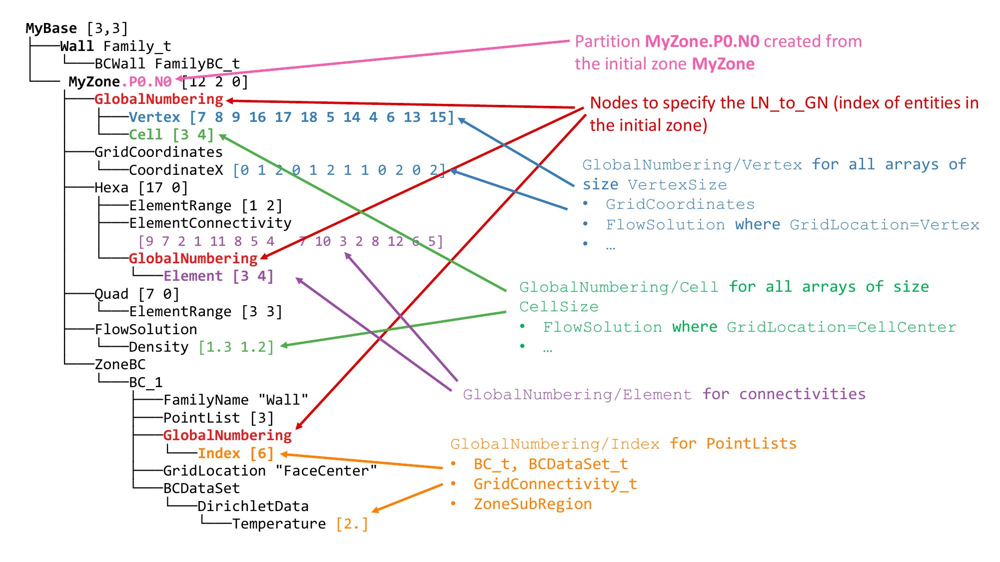

.. _user_man_intro:

Introduction
============

These section introduces the core concepts of distributed and partitioned data
used in Maia, and their application to define parallel CGNS trees.

Core concepts
-------------

Dividing data
^^^^^^^^^^^^^

:def:`Global data` is the complete data that describes an object. Let's represent it as the
following ordered shapes:

.. image:: ./images/dist_part/data_full.svg

Now imagine that you want to split this data into N pieces (N=3 for the next illustrations).
Among all the possibilities, we distinguishes two ways to do it:

1. Preserving order: we call such repartition :def:`distributed data`, and we use the term :def:`block`
   to refer to a piece of this distributed data.

  .. image:: ./images/dist_part/data_dist.svg

  Several distributions are possible, depending on where data is cut, but they all share the same properties: 

    - the original order is preserved across the distributed data,
    - each element appears in one and only one block,
    - a block can be empty as long as the global order is preserved (b).

2. Taking arbitrary subsets of the original data: we call such subsets :def:`partitioned data`, and we use the term :def:`partition`
   to refer to a piece of this partitioned data.

  .. image:: ./images/dist_part/data_part.svg

  Due to this relaxed constraint, there is much more admissible splits since we allow in our definition the following cases:

    - an element can appear in several partitions, or several times within the same partition (b),
    - it is allowed that an element does not appear in a partition (c).

  Such repartitions are often useful when trying to gather the elements depending on
  some characteristics: on the above example, we created the partition of squared shaped elements, round shaped
  elements and unfilled elements (b). Thus, some elements belong to more than one partition.

A key point is that no *absolute* best way of diving data: depending of what we want to do with the
data, one of the way to divide it may be more adapted. In the previous example:

- distributed data is fine if you want to count the number of filled shapes: you can count in each
  block and then sum the result over the blocks.
- Now assume that you want to renumber the elements depending on their shape, then on their color:
  if partitioned data (b) is used, partitions 1 and 2 could independently order 
  their elements by color since they are already sorted by shape [#f1]_.

Numberings
^^^^^^^^^^

In order to describe the link between our divisions and the original global data, we need to
define additional concepts.

For distributed data, since the original ordering is respected, the link with the global data is totally implicit:
we just need to know the number of elements in each block or, equivalently, the :def:`distribution array`
of the data. This is an array of size :mono:`N+1` indicating the bounds of each block. By convention, distribution
array starts at 0 and uses semi-open intervals.

With this information, the global number of the jth element in the ith block is given by
:math:`\mathtt{dist[i] + j + 1}`.

On the contrary, for partitioned data, we have to explicitly store the link with the global data:
we use a :def:`local to global numbering array` (often called :mono:`LN_to_GN` for short). 
Each partition has its own :mono:`LN_to_GN` array whose size is the number of elements in the partition.

.. image:: ./images/dist_part/data_part_gnum.svg

Then, the global number of the jth element in the ith partition is simply given by
:math:`\mathtt{LN\_to\_GN[i][j]}`.

For any global data, these additional informations allow to create a mapping beetween global data, partitioned
data and distributed data. Thus, it is always possible to reconstruct one of the views from another one.

Application to MPI parallelism
^^^^^^^^^^^^^^^^^^^^^^^^^^^^^^

The concepts introduced above make all sense in the context of distributed memory computers.
In such architecture, the global data is in fact never detained by a single proc (it would be too heavy):
we always use a distributed or partitioned view of this data. 
Using a good repartition is often the key of a well balanced algorithm.

In the distributed view, we produce as much blocks as the number of MPI processes. Each process holds
its own block, and the distribution array, of size :mono:`n_rank+1`, is know by each process.

In the partitioned view, we often produce one partition per process; but it can sometime be useful to
put several partitions on a given process. Each process holds the data associated to its partition,
including the related :mono:`LN\_to\_GN` arrays (:mono:`LN\_to\_GN` related to the other partitions
are not know by the current process).

The :ref:`ParaDiGM <related>` library provides some low level methods to exchange data between the partitioned and
distributed views in a MPI context, with options to deal with redundant elements, create new distributions,
manage variable strides, etc.

Application to meshes
---------------------

Until now, we have seen the definition of distributed and partitioned data for a single array
of global data. Let see how to apply these concepts to a basic CFD mesh.

Consider the following 12-vertices (green numbers), 6-quads (purple numbers) mesh and
assume that it is described by a cell to vertex connectivity. Thus, the mesh file defines
3 global arrays: 

- the CoordinateX and CoordinateY arrays, each one of size 12
- the Connectivity array of size 6*4 = 24

.. image:: ./images/dist_part/full_mesh.svg

If we have 2 processes at our disposal, a parallel way to load this mesh is to
distribute all the vertex-related entities with a **distribution array** of :code:`[0,6,12]`
and all the element-related entities with a distribution array of :code:`[0,3,6]` [#f2]_:

.. image:: ./images/dist_part/dist_mesh_arrays.svg

Then, the blue part of the arrays will be stored on the first process and the red part on the second process.
Looking back at the original mesh, this correspond to the following distributed meshes:

.. image:: ./images/dist_part/dist_mesh.svg

with the blue entities stored on the first process, and the red ones on the second process.

Notice that the distributed mesh is not suited for solver computation. For instance, cells on the domain treated by the first process are not connex. Worst yet, vertex and element quantities are distributed independently. Take a look at cell 1: it is blue so it belongs to process 0. However,its vertices 9 and 10 are on process 1, this means that there coordinates are not accessible directly on process 0. For these reasons, we want to properly partition our mesh, such as this:

.. image:: ./images/dist_part/part_mesh.svg

.. image:: ./images/dist_part/part_mesh_arrays.svg

Now we have two semi-independent meshes and we can reason about each element with all its associated data
present on the same process. This partitioned view of the mesh has the two following properties:

  - Coherency: every data array is addressable locally,
  - Connexity: the data represents geometrical entities that define a local subregion of the mesh.

We want to keep the link between the base mesh and its partitioned version. For that, we need to store :def:`global numbering arrays`, quantity by quantity:

For example, for sub-mesh 0, we can check that element number 3 is actually element number 6 of the original mesh.
We can also see that vertex 3 of sub-mesh 0, and vertex 1 of submesh 1 are actually the same, that is, vertex 4 of the global mesh.

Thanks to these global numbering, any quantity computed on the partitioned meshes (such as a vertex based field)
can then be transfered to the corresponding distributed vertex, before writting back the results.

Maia CGNS trees
---------------

Overview
^^^^^^^^

Since Python/CGNS trees describe CFD meshes, we can apply the previous concepts to
define parallel trees.

A :def:`full tree` is a tree as it is inside a CGNS file, or how it would be loaded by only one process. A full tree is **global data**.

A :def:`dist tree` is a CGNS tree where the tree structure is replicated across all processes, but array values of the nodes are distributed, that is, each process only stores a block of the complete array. See :ref:`dist_tree`.

A :def:`part tree` is a partial tree, i.e. a tree for which each zone is only stored by one process. Each zone is fully stored by its process. See :ref:`part_tree`.

A :def:`size tree` is a tree in which only the size of the data is stored. A *size tree* is typically *global data* because each process needs it to know which *block* of data it will have to load and store.

([Legacy] A :def:`skeleton tree` is a collective tree in which fields and element connectivities are not loaded)

As explained in previous section, the standard full tree does not make sense in the context of a MPI parallel
application: all the trees encountered within the execution of maia are **distributed trees** or **partitioned trees**.
The next section describe the specification of these trees.

Specification
^^^^^^^^^^^^^

Let us use the following tree as an example:

This tree is a **global tree**. It may appear like that on a HDF5/CGNS file, or if loaded entirely on one process as a Python/CGNS tree.

.. _dist_tree:

Distributed trees
"""""""""""""""""

A :def:`dist tree` is a CGNS tree where the tree structure is replicated across all processes, but array values of the nodes are distributed, that is, each process only stores a block of the complete array.

If we distribute our tree over two processes, we would then have something like that:

.. image:: ./images/trees/dist_tree.png

Let us look at one of them and annotate nodes specific to the distributed tree:

Arrays of non-constant size are distributed: fields, connectivities, :cgns:`PointLists`.
Others (:cgns:`PointRanges`, :cgns:`CGNSBase_t` and :cgns:`Zone_t` dimensions...) are of limited size and therefore replicated on all processes with virtually no memory penalty.

On each process, for each entity kind, a **partial distribution** is stored, that gives information of which block of the arrays are stored locally.

For example, for process 0, the distribution array of vertices of :cgns:`MyZone` is located at :cgns:`MyBase/MyZone/Distribution/Vertex` and is equal to :code:`[0, 9, 18]`. It means that only indices in the semi-open interval :code:`[0 9)` are stored by the **dist tree** on this process, and that the total size of the array is :code:`18`.
This partial distribution applies to arrays spaning all the vertices of the zone, e.g. :cgns:`CoordinateX`.

More formally, a :def:`partial distribution` related to an entity kind :code:`E` is an array :code:`[start,end,total_size]` of 3 integers where :code:`[start:end)` is a closed/open interval giving, for all global arrays related to :code:`E`, the sub-array that is stored locally on the distributed tree, and :code:`total_size` is the global size of the arrays related to :code:`E`.

The distributed entities are:

.. glossary::
      Vertices and Cells
        The **partial distribution** are stored in :cgns:`Distribution/Vertex` and :cgns:`Distribution/Cell` nodes at the level of the :cgns:`Zone_t` node.

        Used for example by :cgns:`GridCoordinates_t` and :cgns:`FlowSolution_t` nodes if they do not have a :cgns:`PointList` (i.e. if they span the entire vertices/cells of the zone)

      Quantities described by a :cgns:`PointList` or :cgns:`PointRange`
        The **partial distribution** is stored in a :cgns:`Distribution/Index` node at the level of the :cgns:`PointList/PointRange`

        For example, :cgns:`ZoneSubRegion_t` and :cgns:`BCDataSet_t` nodes.

        If the quantity is described by a :cgns:`PointList`, then the :cgns:`PointList` itself is distributed the same way (in contrast, a :cgns:`PointRange` is fully replicated across processes because it is lightweight)

      Connectivities
        The **partial distribution** is stored in a :cgns:`Distribution/Element` node at the level of the :cgns:`Element_t` node. Its values are related to the elements, not the vertices of the connectivity array.

        If the element type is heterogenous (NGon, NFace or MIXED) a :cgns:`Distribution/ElementConnectivity` is also present, and this partial distribution is related to the :cgns:`ElementConnectivity` array.

.. note::
  A distributed tree object is not norm-compliant since most of its arrays are partial: on the previous example,
  :cgns:`CoordinateX` array on rank 0 has a length of 9 when :cgns:`MyZone` declares 18 vertices.
  However, the union of all the distributed tree objects represents a norm-compliant CGNS tree.

.. _part_tree:

Partitioned trees
"""""""""""""""""

A :def:`part tree` is a partial CGNS tree, i.e. a tree for which each zone is only stored by one process. Each zone is fully stored by its process.

If we take the global tree from before and partition it, we may get the following tree:

If we annotate the first one:

A **part tree** is just a regular, norm-compliant tree with additional information (in the form of :cgns:`GlobalNumbering` nodes) that keeps the link with the unpartitioned tree it comes from. Notice that the tree structure is **not** necessarily the same across all processes.

The :cgns:`GlobalNumbering` nodes are located at the same positions that the :cgns:`Distribution` nodes were in the distributed tree.

A :cgns:`GlobalNumbering` contains information to link an entity in the partition to its corresponding entity in the original tree. For example, the element section :cgns:`Hexa` has a global numbering array of value :code:`[3 4]`. It means:

* Since it is an array of size 2, there is 2 elements in this section (which is confirmed by the :cgns:`ElementRange`) ,
* The first element was the element of id :code:`3` in the original mesh,
* The second element was element :code:`4` in the original mesh.

Naming conventions
""""""""""""""""""

When partitioning, some nodes are split, so there is convention to keep track of the fact they come from the same original node:

* :cgns:`Zone_t` nodes : :cgns:`MyZone` is split in :cgns:`MyZone.PX.NY` where `X` is the rank of the process, and `Y` is the id of the zone on process `X`.
* Splitable nodes (notably :cgns:`GC_t`) : :cgns:`MyNode` is split in :cgns:`MyNode.N`. They appear in the following scenario:

  * We partition for 3 processes
  * :cgns:`Zone0` is connected to :cgns:`Zone1` through :cgns:`GridConnectivity_0_to_1`
  * :cgns:`Zone0` is not split (but goes to process 0 and becomes :cgns:`Zone0.P0.N0`). Zone1 is split into :cgns:`Zone1.P1.N0` and :cgns:`Zone1.P2.N0`. Then :cgns:`GridConnectivity_0_to_1` of :cgns:`Zone0` must be split into :cgns:`GridConnectivity_0_to_1.1` and :cgns:`GridConnectivity_0_to_1.2`.

Note that partitioning may induce new :cgns:`GC_t` internal to the original zone being splitted. Their name is implementation-defined and those nodes do not have a :cgns:`GlobalNumbering` since they did not exist in the original mesh.

.. _maia_tree:

Maia trees
^^^^^^^^^^

A CGNS tree is said to be a :def:`Maia tree` if it has the following properties:

* For each unstructured zone, the :cgns:`ElementRange` of all :cgns:`Elements_t` sections

  * are contiguous
  * are ordered by ascending dimensions (i.e. edges come first, then faces, then cells)
  * the first section starts at 1
  * there is at most one section by element type (e.g. not possible to have two :cgns:`QUAD_4` sections)

Notice that this is property is required by **some** functions of Maia, not all of them!

A **Maia tree** may be a **global tree**, a **distributed tree** or a **partitioned tree**.

.. rubric:: Footnotes

.. [#f1] Actually, such algorithm could be written for distributed data, but is less intuitive and require more knowledge of what
         if happening on the other blocks.

.. [#f2] Other distributions are possible : we could, for example, affect all the CoordinateX array on the first process (using the distribution array :code:`[0,12,12]`) and the CoordinateY array on the second, but we would have to manage a different distribution for each array.
