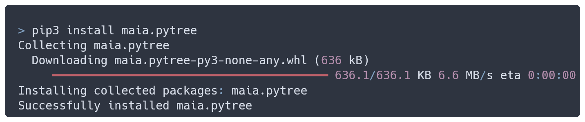
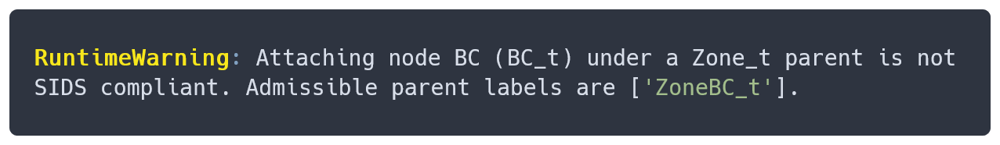
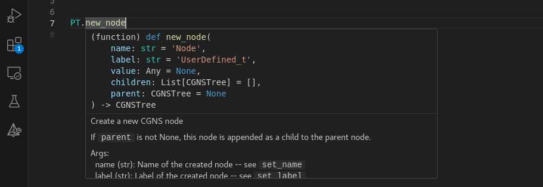

.. _pytree_module:

#################
The pytree module
#################

The ``maia.pytree`` module is dedicated to the exploration, manipulation and comparison 
of python CGNS trees. This module is independant of maia representation of
:ref:`parallel trees <tree_defs>` ; its content executes in a sequential context.

:titlelike:`Motivations`

This module tries to achieve the following goals:

.. :titlelike:`Why a new module ?`

.. While some alternatives for such applications exist, they suffer from a lack of
  maintenance, difficulty to install or dated style.
  This new module try to achieve the following points :

.. rubric:: Light, portable and easy to install

By avoiding compiled code and minimizing external dependencies,
``maia.pytree`` should work on every machine.

.. rubric:: Committed to CGNS standard

``maia.pytree`` works with nothing more than the standard
`CGNS/Python mapping
<https://cgns.github.io/CGNS_docs_current/python/index.html>`_
which makes it easily interoperable. 
In addition, it exploits the 
`CGNS/SIDS description
<https://cgns.github.io/CGNS_docs_current/sids/index.html>`_
to propose relevant actions on specific nodes.

..  RuntimeWarning: Attaching node BC (BC_t) under a Zone_t parent is not SIDS compliant. Admissible parent labels are ['ZoneBC_t'].

.. rubric:: Modern python

We hope that type hints, detailled docstrings and adhesion to PEP8 guidelines 
will make your user experience of ``maia.pytree`` as pleasant as possible.

.. rubric:: Code quality

Thoroughly tested functionalities, continuous integration setup and automatically
tested documentation make ``maia.pytree`` as reliable as possible.

.. note:: This module is still under construction. We are trying our best to fulfill the above goals.
  Contributions and feedbacks are welcomed on
  `Gitlab <https://gitlab.onera.net/numerics/mesh/maia>`_ !

:titlelike:`Using the documentation`

This documentation serves as an API reference but also as a tutorial to explain 
the different features of ``maia.pytree``. 

Unless otherwise specified, all the described
functions are accessible from the module namespace, shortened as ``PT``:

:: 

  import maia.pytree as PT

Code snippets appearing in this
documentation follow the doctest formatting:

>>> PT.__name__   # Command prompted
'maia.pytree'     # Expected output

The features are regrouped in the following sections:

.. Do table by hand to add comments

- :ref:`Basic node editing <pt_node_edit>` : how to edit the information of a
  given CGNSNode
- :ref:`Node inspection <pt_inspect>` : how to get label-specific information from
  a CGNSNode
- :ref:`Node creation presets <pt_presets>` : how to create label-specific CGNSNodes with 
  suitable options
- :ref:`Node searching <pt_node_search>` : how to search specific
  nodes in a CGNSTree from various criteria

.. Include files

.. toctree::
  :maxdepth: 1
  :hidden:

  basic
  search
  inspect
  presets
