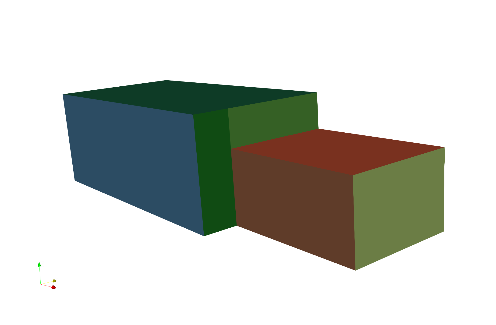
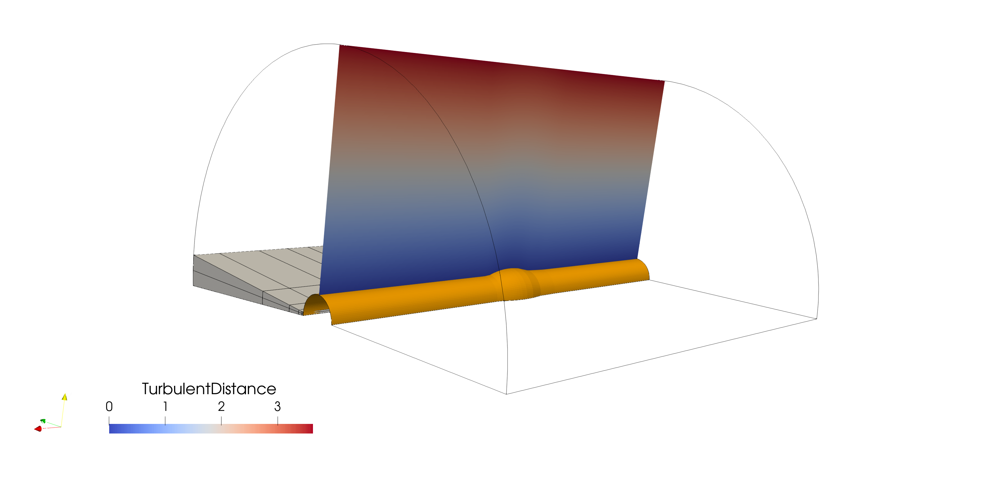
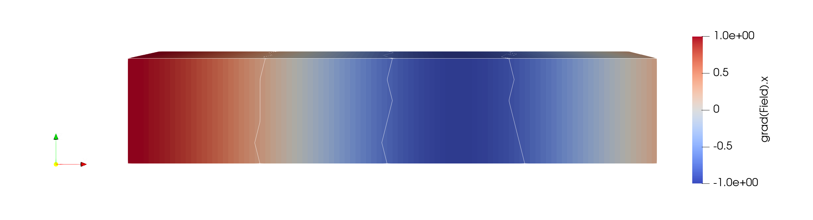

.. _quick_start:

.. currentmodule:: maia

Quick start
===========

Environnements
--------------

Maia is now distributed in elsA releases (since v5.2.01) ! Here is an extract of the embedded maia version number for
the latest elsA releases (see elsA documentation for full list) :

  +----------+--------+--------+--------+--------+
  | **elsA** | 5.2.03 | 5.3.01 | 5.3.02 | 5.3.03 |
  +----------+--------+--------+--------+--------+
  | **maia** | v1.2   | v1.3.1 | v1.4.1 | v1.5   |
  +----------+--------+--------+--------+--------+

If you need more flexibility or if you want to try the latest features, maia releases are also deployed on Onera clusters.
This is done through *modulefiles*, named following these conventions:

- 3 figures modules (eg ``maia/1.4.0``) load the specified version;
- 2 figures modules (eg ``maia/1.4``) load the latest available patchrelease (for example ``1.4.2``);
- ``maia/dev`` loads the latest build (which may be unstable, use it carefully);
- a suffix is used to indicate the compatible software socle, depending on the machine.

.. tabs::

  .. tab:: Spiro-EL8

    .. code-block:: sh

      module use --append /scratchm/sonics/usr/modules/
      module load maia/dev-dsi-cfd6

    For versions of maia up to 1.5, in addition to the DSI provided environments (socle-cfd/\*),
    we also support the IntelMPI/GCC software chain used by former versions of Sonics.
    Those versions are suffixed by the ``"default"`` keyword and require the dependancies 
    to be loaded manually, using this additional source command:

    .. code-block:: sh

      source /scratchm/sonics/dist/source.sh --env maia
      module load maia/1.5-default

  .. tab:: Juno

    Maia is available on Juno since v1.2. There is only one flavor on Juno, which is socle-cfd/6.0-intel2220-impi.

    .. code-block:: sh

      module use --append /tmp_user/juno/sonics/usr/modules/
      module load maia/dev-dsi-cfd6

  .. tab:: Sator

    Since Sator is the production cluster, Maia is compiled with support of large (I8) integers.
    If needed, I4 versions (as distributed on other machines) are also available and are suffixed
    by ``_idx32``.
    
    The supported environments are the same than for Spiro-EL8:

    .. code-block:: sh

      # Versions based on socle-cfd compilers and tools
      module use --append /tmp_user/sator/sonics/usr/modules/
      module load maia/dev-dsi-cfd6

      # Versions based on self compiled tools (only for versions ≤ 1.5)
      source /tmp_user/sator/sonics/dist/source.sh --env maia
      module load maia/1.5-default

  .. tab:: LD

    This installation is compatible with Rocky Linux 8 workstations, and uses the same software chain than elsA
    on these workstations (OpenMPI/GCC).

    .. code-block:: sh

      module use --append /stck/sonics/LD8/modules/
      module load maia/dev-dsi-ompi405

If you prefer to build your own version of Maia, see :ref:`installation` section.

Supported meshes
----------------

.. _quick_start_req:

Maia supports CGNS meshes from version 4.2, meaning that polyhedral connectivities (NGON_n, NFACE_n
and MIXED nodes) must have the ``ElementStartOffset`` node.

Former meshes can be converted with the (sequential) maia_poly_old_to_new script included
in the ``$PATH`` once the environment is loaded:

.. code-block:: sh

  $> maia_poly_old_to_new mesh_file.hdf

The opposite maia_poly_new_to_old script can be used to put back meshes
in old conventions, insuring compatibility with legacy tools.

.. warning:: CGNS databases should respect the `SIDS <https://cgns.org/standard/SIDS/CGNS_SIDS.html>`_.
  The most commonly observed non-compliant practices are:

  - Empty ``DataArray_t`` (of size 0) under ``FlowSolution_t`` containers.
  - 2D shaped (N1,N2) ``DataArray_t`` under ``BCData_t`` containers.
    These arrays should be flat (N1xN2,).
  - Implicit ``BCDataSet_t`` location for structured meshes: if ``GridLocation_t`` 
    and ``PointRange_t`` of a given ``BCDataSet_t`` differs from the
    parent ``BC_t`` node, theses nodes should be explicitly defined at ``BCDataSet_t``
    level.

  Several non-compliant practices can be detected with the ``cgnscheck`` utility. Do not hesitate
  to check your file if Maia is unable to read it.

Note also that ADF files are not supported; CGNS files should use the HDF binary format. ADF files can
be converted to HDF thanks to ``cgnsconvert``.

Highlights
----------

.. tip:: Download sample files of this section:
  :download:`S_twoblocks.cgns <../share/_generated/S_twoblocks.cgns>`,
  :download:`U_ATB_45.cgns <../share/_generated/U_ATB_45.cgns>`

.. rubric:: Daily user-friendly pre & post processing

Maia provides simple Python APIs to easily setup pre or post processing operations:
for example, converting a structured tree into an unstructured (NGon) tree
is as simple as

.. literalinclude:: snippets/test_quick_start.py
  :start-after: #basic_algo@start
  :end-before: #basic_algo@end
  :dedent: 2

In addition of being parallel, the algorithms are as much as possible topologic, meaning that
they do not rely on a geometric tolerance. This also allow us to preserve the boundary groups
included in the input mesh (colored on the above picture).

.. rubric:: Building efficient workflows

By chaining this elementary blocks, you can build a **fully parallel** advanced workflow
running as a **single job** and **minimizing file usage**.

In the following example, we load an angular section of the
`ATB case  <https://turbmodels.larc.nasa.gov/axibump_val.html>`_,
duplicate it to a 180° case, split it, and perform some slices and extractions.

.. literalinclude:: snippets/test_quick_start.py
  :start-after: #workflow@start
  :end-before: #workflow@end
  :dedent: 2

The above illustration represents the input mesh (gray volumic block) and the
extracted surfacic tree (plane slice and extracted wall BC). Curved lines are
the outline of the volumic mesh after duplication.

.. rubric:: Compliant with the pyCGNS world

Finally, since Maia uses the standard `CGNS/Python mapping 
<https://cgns.org/standard/python.html>`_,
you can set up applications involving multiple python packages:
here, we create and split a mesh with maia, but we then call Cassiopee functions
to compute the gradient of a field on each partition.

.. literalinclude:: snippets/test_quick_start.py
  :start-after: #pycgns@start
  :end-before: #pycgns@end
  :dedent: 2

Be aware that other tools often expect to receive geometrically
consistent data, which is why we send the partitioned tree to
Cassiopee functions. The outline of this partitions (using 4 processes)
are materialized by the white lines on the above figure.

Resources and Troubleshouting
-----------------------------

The :ref:`user manual <user_manual>` describes most of the high level APIs provided by Maia.
If you want to be comfortable with the underlying concepts of distributed and
partitioned trees, have a look at the :ref:`introduction <intro>` section.

The user manual is illustrated with basic examples. Additional
test cases can be found in 
`the sources <https://gitlab.onera.net/numerics/mesh/maia/-/tree/dev/test>`_.

Issues can be reported on 
`the gitlab board <https://gitlab.onera.net/numerics/mesh/maia/-/issues>`_
and help can also be asked on the dedicated
`Element room <https://synapse.onera.fr/#/room/!OcgyjrTUlihJWTYWbq:synapse.onera.fr?via=synapse.onera.fr>`_.
