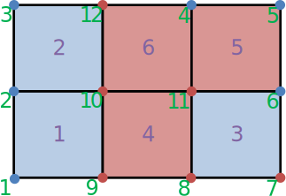
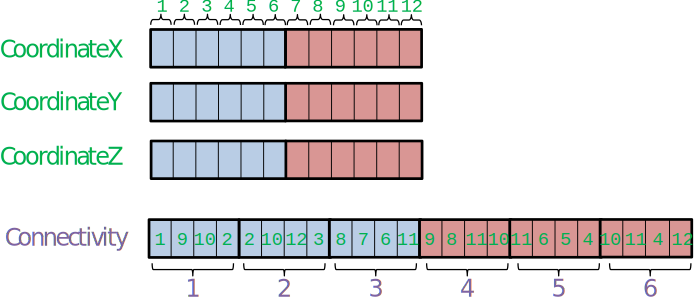
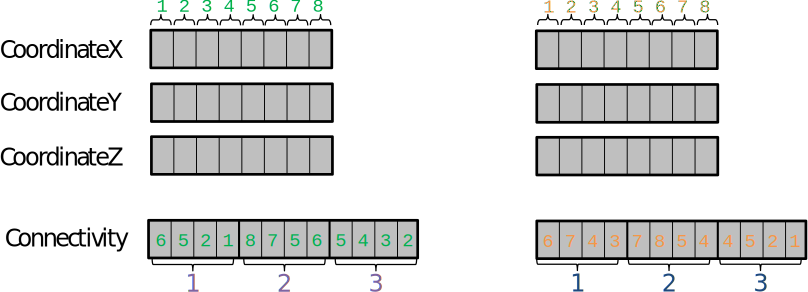
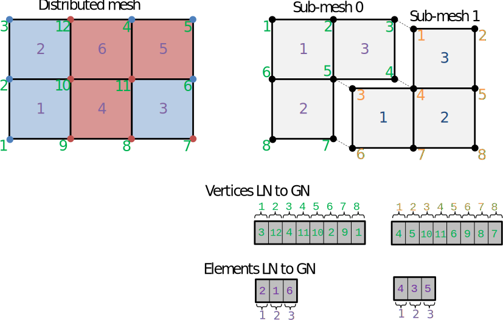

.. _user_man_intro:

Introduction
============

Vocabulary
----------

Global data
^^^^^^^^^^^

:def:`Global data` is the complete data that describes an object.

Distributed data
^^^^^^^^^^^^^^^^

:def:`Distributed data` is data that is stored over multiple memory spaces. The data can't be accessed completely by one process. It has to be distributed over memory either because it is too heavy, or in order to take advantage of parallel algorithms.

A :def:`block` of distributed data is the portion of that data that is stored over one memory space. Each block can only be interpreted as a piece of the **global data**.

Example: a field array where portions of the data are stored on multiple computer nodes.

Partitions
^^^^^^^^^^

Contrary to a **block** of distributed data, a :def:`partition` is a coherent data structure that can be operated in semi-isolation. In order to take advantage of parallel algorithms, most of the time we want to deal with multiple partitions on multiple memory spaces. Of course, partitions are linked together, but the idea is to alternate between isolated computations on each partition, and information exchange between partitions.

Example: the sub-domain of a mesh used in a solver.

Collective data and operations
^^^^^^^^^^^^^^^^^^^^^^^^^^^^^^

:def:`Collective data` over a set of processes is a piece of the same data that is repeated on the memory space of each process.

Example: a **distribution array** (see below).

A :def:`collective operation` is an action in which a set of processes must participate in.

Example: a broadcast.

Distribution array
^^^^^^^^^^^^^^^^^^

A :def:`distribution array`, or :def:`distribution`, is an array which describes how **global data** is **distributed** over memory spaces. Say that I have a global array of 500 elements and it is uniformly distributed over 5 processes. Then its distribution would be the array :math:`\mathtt{dist}=[0,100,200,300,400,500]`. Process :math:`i` will store a *block* of data spanning the semi-open interval :math:`\left[ \mathtt{dist}[i],\mathtt{dist}[i+1] \right)`.

Distribution arrays are most of the time **collective data**, because each process holding a **block** of data needs to know which range of the data it is holding, and which range the others are holding.

Local and global numbering
^^^^^^^^^^^^^^^^^^^^^^^^^^

If **global data** were to be seen only as **distributed blocks** of memory over processes, life would be relatively simple. However, many algorithms require to **operate on partitions**. Hence, global data has to be partitioned.

However, the link between an **entity in a partition** (say, a vertex in a mesh partition) and **the entity of the global data it was created from** (the same vertex, but in the original, global mesh) must be kept for multiple reasons. Maybe the most important one is that during the partitioning process, some entities of the global data are duplicated over multiple partitions (e.g. the matching vertices of two partitions), but they still represent the same data (they represent the same original vertex).

In order to know, for an element of a partition, which global entity it represents, we use a :def:`local to global numbering array` (often called :code:`LN_to_GN` for short). Each partition has a :code:`LN_to_GN` array. For an element at index :code:`i` in array :code:`A` (called the :def:`local numbering`), :code:`LN_to_GN[i]` gives the :def:`global numbering`, that is, the global identifier of the element in the **global** array.

Example
^^^^^^^

Consider the following 12-vertices, 6-quads mesh:

The vertex ids are written in green and the element ids in purple. Now suppose that we want to distribute the vertex-related entities among two processes, with a **distribution array** of :code:`[0,6,12]`, and element-related entities with a distribution array of :code:`[0,3,6]`.

The blue entities will the be stored on the first process, and the red ones on the second process.

Suppose that we are interested in the vertex coordinate field and the element connectivities:

Then the blue part of the array will be stored on the first process and the red part on the second process.

Notice that the distributed mesh is not suited for solver computation. For instance, cells on the domain treated by the first process are not connex. Worst yet, vertex and element quantities are distributed independently. Take a look at cell 1: it is blue so it belongs to process 0. However,its vertices 9 and 10 are on process 1, this means that there coordinates are not accessible directly on process 0. For these reasons, we want to properly partition our mesh, such as this:

.. image:: ./images/dist_part/part_mesh.svg

Now we have two semi-independent meshes and we can reason about each element with all its associated data present on the same process.

We want to keep the link between the base mesh and its partitioned version. For that, we need to store :def:`global numbering arrays`, quantity by quantity:

For example, for sub-mesh 0, we can check that element number 3 is actually element number 6 of the original mesh.

We can also see that vertex 3 of sub-mesh 0, and vertex 1 of submesh 1 are actually the same, that is, vertex 4 of the global mesh.

CGNS trees
----------

Parallel CGNS trees
^^^^^^^^^^^^^^^^^^^

Depending on the purpose, we need to use multiple type of CGNS trees.

A :def:`full tree` is a tree as it is inside a CGNS file, or how it would be loaded by only one process. A full tree is **global data**.

A :def:`dist tree` is a CGNS tree where the tree structure is replicated across all processes, but array values of the nodes are distributed, that is, each process only stores a block of the complete array. See :ref:`dist_tree`.

A :def:`part tree` is a partial tree, i.e. a tree for which each zone is only stored by one process. Each zone is fully stored by its process. See :ref:`part_tree`.

A :def:`size tree` is a tree in which only the size of the data is stored. A *size tree* is typically *global data* because each process needs it to know which *block* of data it will have to load and store.

([Legacy] A :def:`skeleton tree` is a collective tree in which fields and element connectivities are not loaded)

Typical workflow with Maia
--------------------------

.. image:: ./images/workflow/workflow.svg

Most of the time, the mesh we want to operate on is not partitioned. This is mainly due to the fact that the partitoning we want depends on the number of processes we want to use, and this number depend on the execution context. The typical workflow one wants to use is the following:

1. Begin with a non-partitioned tree. The tree may have several zones because of the configuration of the mesh (e.g. multiple stages in turbomachinery), but these physical zones are not *a priori* the ones that we want for our CFD computation (e.g. because the number of zones is less than the number of processes, or the zones are unbalanced).
2. Load this tree as a **dist tree**. See :ref:`dist_tree`
3. A **part tree** is computed from the **dist tree** by calling graph partitioning algorithms, then transfering fields. The **part tree** contains :code:`LN_to_GN` information to keep the link with the **dist tree** it has been generated from.
4. The solver is called over the **part tree**
5. The result fields are transfered back to the **dist tree**
6. The updated **dist tree** is saved to disk.

Other workflows and refinements
-------------------------------

Merging partitions
^^^^^^^^^^^^^^^^^^

Since partitioning depends on the number of ressources we want to use, it is a computation strategy detail and it should not be kept when saving a file. As a matter of fact, inside the global mesh, the one saved to disk, zones should only materialize different components (e.g. multiple stages in turbumachinery), NOT different partitions.

If this is not the case, we may want to merge zones. Indeed, it may simplify pre/post-processing of the mesh. Plus, the bigger the zone is, the more freedom there will be to optimize partitioning.

Note: As long a the :code:`LN_to_GN` arrays are kept, merging partitions back to the original mesh is easy.

